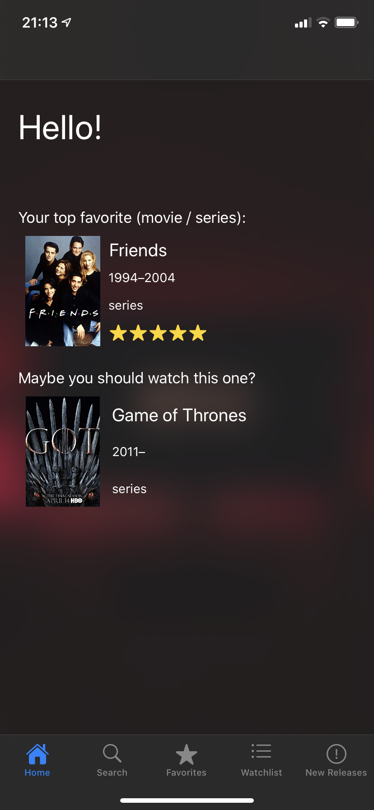
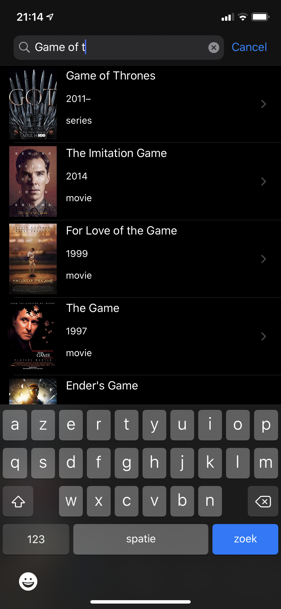
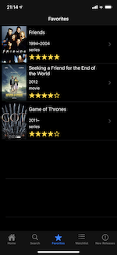
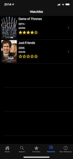
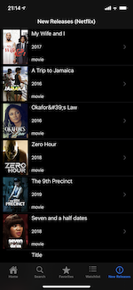
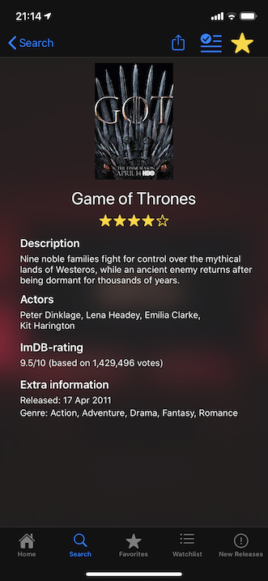

Rob De Putter (HOGENT - Group: 3C)

# MyMovies
> IOS application


MyMovies is an application where you can look up all movies and series. You can request a detailed list to provide more information about a particular film or series.  There is also a possibility to add them to your watchlist or favorites. 

Furthermore, this app also offers the possibility to consult the latest releases of Netflix, so you can already look forward to a brand new season of your favorite series.

If you like to let your friends know about a movie or series that you liked very much, you can share it through different platforms (mail, messages, messenger,...).

## Screenshots
   
   

## External frameworks
1. [Realm](https://realm.io) 
2. [ReachabilitySwift](https://github.com/ashleymills/Reachability.swift)
## Requirements

- iOS 13.0+
- Xcode 11.3

## Installation
### 1. Clone this repository
```bash
git clone https://github.com/robdeputter/MyMovies_IOS.git
```

### 2. Install pods
```bash
$ pod install
```
## Developer

Rob De Putter – [LinkedIn](https://www.linkedin.com/feed/)

Distributed under the MIT license. See ``LICENSE`` for more information.

[https://github.com/robdeputter](https://github.com/robdeputter)

[swift-image]:https://img.shields.io/badge/swift-5.0-orange.svg
[swift-url]: https://swift.org/
[license-image]: https://img.shields.io/badge/License-MIT-blue.svg
[license-url]: LICENSE
[travis-image]: https://img.shields.io/travis/dbader/node-datadog-metrics/master.svg?style=flat-square
[travis-url]: https://travis-ci.org/dbader/node-datadog-metrics
[codebeat-image]: https://codebeat.co/badges/c19b47ea-2f9d-45df-8458-b2d952fe9dad
[codebeat-url]: https://codebeat.co/projects/github-com-vsouza-awesomeios-com.
## Source README
[README template](https://github.com/awesome-labs/iOS-readme-template/blob/master/README.md)

